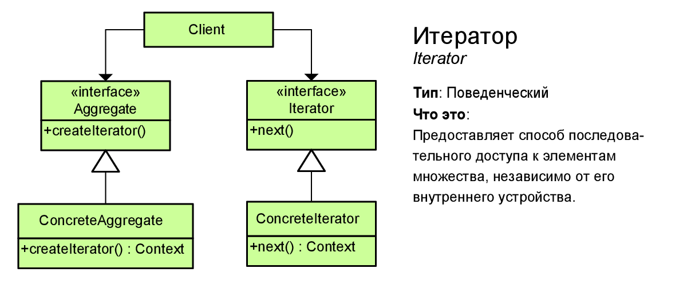

# Итератор (Iterator)

Поведенческий паттерн,
позволяющий последовательно обходить сложную коллекцию,
без раскрытия деталей её реализации.



## Признаки применения паттерна

Итератор легко определить по методам навигации (например,
получения следующего/предыдущего элемента и т. д.).
Код использующий итератор зачастую вообще не имеет ссылок на коллекцию,
с которой работает итератор.
Итератор либо принимает коллекцию в параметрах конструкторе при создании,
либо возвращается самой коллекцией.

## Standart Interfaces

[Iterator](https://www.php.net/manual/ru/class.iterator.php)

[IteratorAggregate](https://www.php.net/manual/ru/class.iteratoraggregate.php)

```php
<?php

class AlphabeticalOrderIterator implements Iterator
{
  private $collection;
  private $position = 0;
  private $reverse = false;

  public function __construct($collection, $reverse = false)
  {
    $this->collection = $collection;
    $this->reverse = $reverse;
  }

  public function rewind()
  {
    $this->position = $this->reverse ?
        count($this->collection->getItems()) - 1 : 0;
  }

  public function current()
  {
    return $this->collection->getItems()[$this->position];
  }

  public function key()
  {
    return $this->position;
  }

  public function next()
  {
    $this->position = $this->position + ($this->reverse ? -1 : 1);
  }

  public function valid()
  {
    return isset($this->collection->getItems()[$this->position]);
  }
}
```

```php
class WordsCollection implements IteratorAggregate
{
  private $items = [];

  public function getItems()
  {
    return $this->items;
  }

  public function addItem($item)
  {
    $this->items[] = $item;
  }

  public function getIterator(): Iterator
  {
    return new AlphabeticalOrderIterator($this);
  }

  public function getReverseIterator(): Iterator
  {
    return new AlphabeticalOrderIterator($this, true);
  }
}
```

## Usage

```php
$collection = new WordsCollection;
$collection->addItem("First");
$collection->addItem("Second");
$collection->addItem("Third");

echo "Straight traversal:\n"; foreach ($collection->getIterator() as $item) {
  echo $item . "\n";
}

echo "\n";
echo "Reverse traversal:\n";
foreach ($collection->getReverseIterator() as $item) {
  echo $item . "\n";
}
```

## Result

```
Straight traversal:
First
Second
Third

Reverse traversal:
Third
Second
First
```
