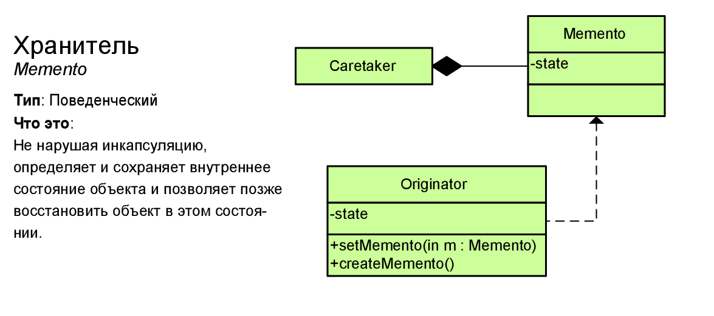

# Хранитель (Memento)

Позволяет не нарушая инкапсуляцию зафиксировать и сохранить внутренние состояния объекта так, чтобы позднее восстановить его в этих состояниях.



## Преимущества

* Не нарушает инкапсуляции исходного объекта.
* Упрощает структуру исходного объекта. Ему не нужно хранить историю версий своего состояния.

## Недостатки

* Требует много памяти, если клиенты слишком часто создают снимки.
* Может повлечь дополнительные издержки памяти, если объекты, хранящие историю, не освобождают ресурсы, занятые устаревшими снимками.
* В некоторых языках (например, PHP, Python, JavaScript) сложно гарантировать, чтобы только исходный объект имел доступ к состоянию снимка.

```php
<?php

interface Memento
{
  public function getName();
  public function getDate();
}
```

```php
class Originator
{
  private $state;

  public function __construct(string $state)
  {
    $this->state = $state;
    echo "Originator: Initial state is: {$this->state}\n";
  }

  public function doSomething()
  {
    echo "Originator: Doing something.\n";
    $this->state = $this->generateRandomString(30);
    echo "Originator: State has changed to: {$this->state}\n";
  }

  private function generateRandomString($length = 10)
  {
    return substr(
      str_shuffle(
        str_repeat(
          $x = 'abcdefghijklmnopqrstuvwxyzABCDEFGHIJKLMNOPQRSTUVWXYZ',
          ceil($length / strlen($x))
        )
      ),
      1,
      $length
    );
  }

  public function save()
  {
    return new ConcreteMemento($this->state);
  }

  public function restore(Memento $memento)
  {
    $this->state = $memento->getState();
    echo "Originator: State has changed to: {$this->state}\n";
  }
}
```

```php
class ConcreteMemento implements Memento
{
  private $state;
  private $date;

  public function __construct(string $state)
  {
    $this->state = $state;
    $this->date = date('Y-m-d H:i:s');
  }

  public function getState()
  {
    return $this->state;
  }

  public function getName()
  {
    return $this->date . " / (" . substr($this->state, 0, 9) . "...)";
  }

  public function getDate()
  {
    return $this->date;
  }
}
```

```php
class Caretaker
{

  private $mementos = [];
  private $originator;

  public function __construct(Originator $originator)
  {
    $this->originator = $originator;
  }

  public function backup()
  {
    echo "\nCaretaker: Saving Originator's state...\n";
    $this->mementos[] = $this->originator->save();
  }

  public function undo()
  {
    if (!count($this->mementos)) {
      return;
    }

    $memento = array_pop($this->mementos);

    echo "Caretaker: Restoring state to: " . $memento->getName() . "\n";
    try {
      $this->originator->restore($memento);
    } catch (\Exception $e) {
      $this->undo();
    }
  }

  public function showHistory()
  {
    echo "Caretaker: Here's the list of mementos:\n";
    foreach ($this->mementos as $memento) {
      echo $memento->getName() . "\n";
    }
  }
}
```

## Usage

```php
$originator = new Originator("Mega State.");
$caretaker = new Caretaker($originator);

$caretaker->backup();
$originator->doSomething();

$caretaker->backup();
$originator->doSomething();

echo "\n";
$caretaker->showHistory();

echo "\nClient: Now, let's rollback!\n\n";
$caretaker->undo();

echo "\nClient: Once more!\n\n";
$caretaker->undo();
```

## Result

```
Originator: Initial state is: Mega State.

Caretaker: Saving Originator's state...
Originator: Doing something.
Originator: State has changed to: rnOmoRPVkhiBzcyvQaWGxLlFJMdesp

Caretaker: Saving Originator's state...
Originator: Doing something.
Originator: State has changed to: pJdWOYfIHnkacRFoTMhBszKUwEbSCg

Caretaker: Here's the list of mementos:
2020-06-14 10:27:26 / (Mega Stat...)
2020-06-14 10:27:26 / (rnOmoRPVk...)

Client: Now, let's rollback!

Caretaker: Restoring state to: 2020-06-14 10:27:26 / (rnOmoRPVk...)
Originator: State has changed to: rnOmoRPVkhiBzcyvQaWGxLlFJMdesp

Client: Once more!

Caretaker: Restoring state to: 2020-06-14 10:27:26 / (Mega Stat...)
Originator: State has changed to: Mega State.
```
