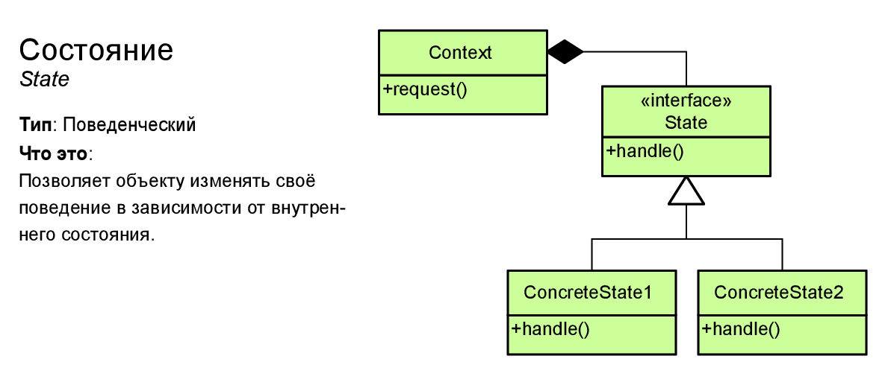

# Состояние

Поведенческий паттерн, позволяющий динамически изменять
поведение объекта при смене его состояния.

Поведения, зависящие от состояния, переезжают в отдельные классы. Первоначальный класс хранит ссылку на
один из таких объектов-состояний и делегирует ему работу.



```php
<?php

class Context
{
  private $state;

  public function __construct(State $state)
  {
    $this->transitionTo($state);
  }

  public function transitionTo(State $state)
  {
    echo "Context: Transition to " . get_class($state) . ".\n";
    $this->state = $state;
    $this->state->setContext($this);
  }

  public function request1()
  {
    $this->state->handle1();
  }

  public function request2()
  {
    $this->state->handle2();
  }
}
```

```php
abstract class State
{
  protected $context;

  public function setContext(Context $context)
  {
      $this->context = $context;
  }

  abstract public function handle1();
  abstract public function handle2();
}

class ConcreteStateA extends State
{
  public function handle1()
  {
    echo "ConcreteStateA handles request1.\n\n";
    echo "ConcreteStateA wants to change the state of the context.\n";
    $this->context->transitionTo(new ConcreteStateB);
  }

  public function handle2()
  {
    echo "ConcreteStateA handles request2.\n";
  }
}

class ConcreteStateB extends State
{
  public function handle1()
  {
    echo "ConcreteStateB handles request1.\n";
  }

  public function handle2()
  {
    echo "ConcreteStateB handles request2.\n\n";
    echo "ConcreteStateB wants to change the state of the context.\n";
    $this->context->transitionTo(new ConcreteStateA);
  }
}
```

## Usage

```php
$context = new Context(new ConcreteStateA);
$context->request1();
$context->request2();
```

## Output

```
Context: Transition to ConcreteStateA.
ConcreteStateA handles request1.

ConcreteStateA wants to change the state of the context.
Context: Transition to ConcreteStateB.
ConcreteStateB handles request2.

ConcreteStateB wants to change the state of the context.
Context: Transition to ConcreteStateA.
```
