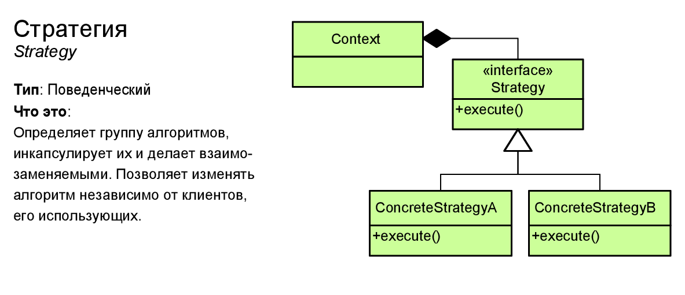

# Стратегия Strategy

## Cуть

Стратегия — это поведенческий паттерн проектирования,
который определяет семейство схожих алгоритмов и помещает каждый
из них в собственный класс, после чего алгоритмы можно взаимозаменять
прямо во время исполнения программы.



## Преимущества

* Горячая замена алгоритмов на лету.
* Изолирует код и данные алгоритмов от остальных классов.
* Уход от наследования к делегированию.
* Реализует принцип открытости/закрытости.

## Недостатки

* Усложняет программу за счёт дополнительных классов.
* Клиент должен знать, в чём состоит разница между стратегиями, чтобы выбрать подходящую.


```php
<?php

interface Strategy
{
  public function execute($data);
}

class Context
{
  private $strategy;
  public function __construct(Strategy $strategy)
  {
    $this->strategy = $strategy;
  }

  public function setPaymentMethod(Strategy $strategy)
  {
    $this->strategy = $strategy;
  }

  public function sellGoods()
  {
    $result = $this->strategy->execute("50");
    echo $result . "\n";
  }
}

class CardStrategy implements Strategy
{
  public function execute($data)
  {
    return "Pay by card: ". $data;
  }
}

class CacheStrategy implements Strategy
{
    public function execute($data)
    {
      return "Pay by cache: ". $data;
    }
}
```

## Usage

```php
$context = new Context(new CardStrategy);
$context->sellGoods();
$context->setPaymentMethod(new CacheStrategy);
$context->sellGoods();
```

## Output

```
Pay by card: 50
Pay by cache: 50
```
